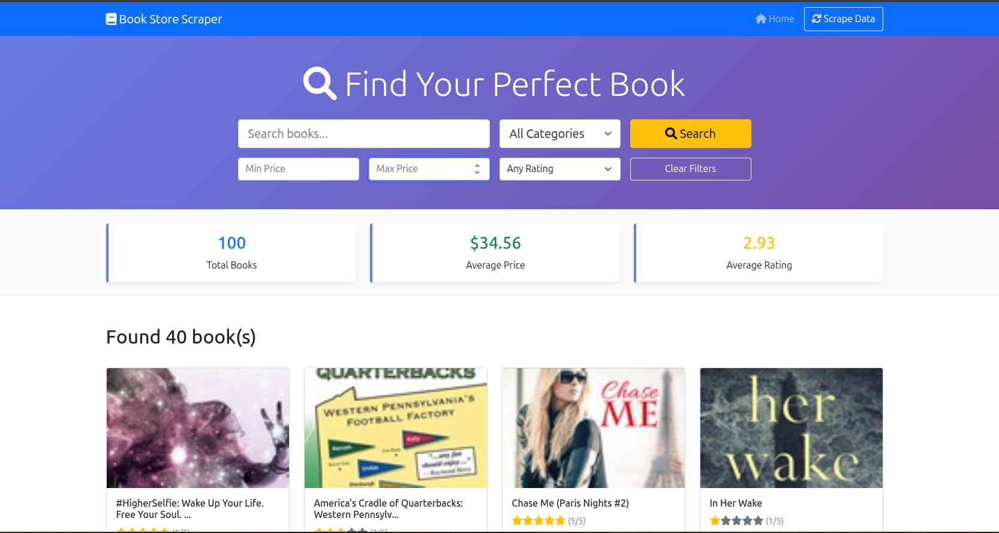

# 📚 Book Store Web Scraper


📌 **Overview**
This Flask web application scrapes book listings from an online source, processes the data, and presents it in a clean **Bootstrap UI**. Users can search by title, category, price, or rating, and instantly view insights such as total number of books, average price, and average rating.

---

📸 **App Screenshot**


---

🔍 **Key Insights**

* **Total Books:** Shows the total number of scraped books (e.g., *100*).
* **Average Price:** Displays the mean book price (e.g., *\$34.56*).
* **Average Rating:** Highlights the average rating across all books (e.g., *2.93*).
* **Search & Filters:** Refine results by keyword, category, price range, or star rating.
* **Live Scraping:** Refresh the dataset at any time using the **Scrape Data** button.

---

📂 **Data Source**

* Scraped from an online bookstore (demo site).
* Extracted attributes include:

  * Title
  * Price
  * Rating
  * Category

---

🛠 **Requirements**

* Python 3.8+
* Flask
* BeautifulSoup4
* Requests
* (Optional) lxml for faster parsing

Install using:

```bash
pip install -r requirements.txt
```

---

🚀 **Get Started**

1. **Clone the repository**

   ```bash
   git clone https://github.com/koligaurav462/web_scraper.git
   cd web_scraper
   ```
2. **Create and activate a virtual environment**

   ```bash
   python3 -m venv venv
   source venv/bin/activate   # On Windows: venv\Scripts\activate
   ```
3. **Install dependencies**

   ```bash
   pip install -r requirements.txt
   ```
4. **Run the app**

   ```bash
   python new.py
   ```
5. **Open in browser**
   Navigate to `http://localhost:5000`
6. **Search & Explore**

   * Use the search bar, category dropdown, and filters.
   * View live metrics at the top of the dashboard.
   * Browse paginated book results with covers, prices, and ratings.

---

📈 **Visuals Included**

* KPI Cards: Total books, average price, average rating.
* Search Bar & Filters: Keyword, category, price range, rating.
* Book Cards: Display title, price, rating, and cover image.
* Interactive Button: Trigger scraping jobs.

---

👤 **Author**
Gaurav Koli

📄 **License**
MIT License
